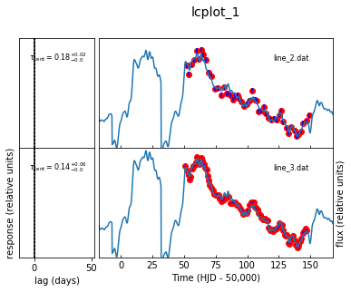
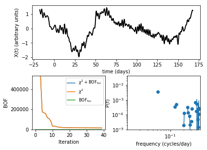

# PyceCREAM

Here is a python implementation of my accretion disc and emission line lightcurve-fitting code (previously CREAM). This guide briefly covers generating synthetic data and calling a new pycecream object to ingest and fit the accretion disc model (or emission line model) to a set of input light curves. I also demonstrate how to access the output of the pycecream fit. The output includes the fitted light curves, any new light curve data points after merging, fitted response functions and parameter MCMC chain histories for the disc and/or tophat response parameters.

Most of these features are used in some form or another from a previous f90 version of this code (CREAM) in the following literature

* Grier et al in prep
* Grier et al 2018    https://iopscience.iop.org/article/10.3847/1538-4357/aa98dc/pdf
* Starkey et al 2017  https://ui.adsabs.harvard.edu/#abs/arXiv:1611.06051
* Starkey et al 2016  https://ui.adsabs.harvard.edu/#abs/arXiv:1511.06162

Please send questions to ds207@st-andrews.ac.uk. Though I am currently taking a break from academia and may take some time to respond, I will try to do so as soon as possible.


## Requirements & Installation

Please ensure that you have a fortran compiler installed. I use Gfortran. If you have an alternate (e.g ifort), please indicate the standard command used to call the fortran compiler using the ```fortran_caller``` argument (default is ```fortran_caller = gfortran```).


command These are fairly easy to install from macports or wget etc. Also a Python version is required (I am using 3.7 but even 2 should be fine). The it's just...

```
pip install pycecream
```


#  Section 1: Generate Synthetic Light Curves

In this example we generate 4 disk light curves and 2 emission-line light curves modeled as a top-hat with a 20-day lag. The code below generates a list where each index contains an Nx3 numpy array for each light curve. The 3 vertical axis for each light curve are the time, flux and noise respectively (query synthetic_data['echo lightcurves'][0] for an example of the format required when inputting your own light curve data).

The example below combines continuum and line light curves and illustrates a case in which you may have two of the same emission line (and so want to fit with the same response function model) but observed from different telescopes that require separate noise models.


```python
import astropy_stark.myfake as mf
import matplotlib.pylab as plt

'''
mf.myfake arguments are

wavelengths: enter the wavelengths (-1 indicates an emission line light curve modelled with a top-hat response),

snr: set the signal-to-noise relative to light curve rms

cadence:set the mean cadence

top hat centroid: set the centroid for the top-hat (I think thats what this does but the line lag 
thing is still newish so Im used to just making continuum light curve)
'''


synthetic_data = mf.myfake(
    [4000.0,5000.0,5000.0,7000.0,-1.0,-1.0],
    [50.0,50.0,10.0,50.0,50,10.],
    [1.0,1.0,2.0,1.0,1.0,3.0],
    thcent = 20.0
)

'''This recovers the synthetic data'''
dat = synthetic_data['echo light curves']
```

#  Section 2: Setup and run PyceCREAM

The script below gives an example on how to set up and run a sample pycecream simulation on a mixture of continuum light curves. Note at the bottom of this document some commands for configuring starting parameters and their step sizes (e.g for inclination accretion rate etc).

A new feature (17/06/2019) is the option to set the starting values and step sizes for the background offset term of each lightcurve. This was previously initialised to the mean with a step size equal to the standard deviation of the light curve data but can now be configured with the 'background_offset_start' when adding each new light curve. This is a list of 2 numbers with the first being the start value and the second corresponding to the step size.

## Vertical scaling and background offset start positions and steps
The same feature is available for the starting vertical 'stretch' parameter for each light curve with the argument set to 'vertical_scaling_start'. The default values of [-1,-1] for these arguments will use the standard starting settings for these parameters.

## Vertical scaling and background offset priors
We can now also add priors to pycecream's offset level and vertical scaling parameters using the `background_offset_prior` and `vertical_scaling_prior` arguments shown below.


```python
import pycecream

#instantiate a pycecream object
a = pycecream.pycecream()

'''
If you use a fortran compiler other than gfortran please indicate here.
I just re-enter gfortran here for demonstration purposes even though 
this is unecassary as gfortran is the default argument.
'''
a.fortran_caller = 'gfortran'


'''Choose an output directory in which to save the results. 
This will be a new directory that you have not previously created (pycecream will make it automatically).

NOTE: Each new cream simulation must have a new name for "output_directory argument below 
otherwise an excpetion is raised. This is to prevent accidentally overwriting previous simulations. 
I might change this in a future version 
'''
a.output_directory = 'fit_synthetic_lightcurves'


'''
Add each of the light curves in the simulation. 
In this case we are using the "dat" output from the synthetic data above.
'''
a.add_lc(dat[0], name = 'continuum 4000',wavelength = 4000.0,
         kind='continuum',
         background_offset_start=[10.0,0.0],vertical_scaling_start=[2.0,0.5]))

a.add_lc(dat[1], wavelength = 5000.0, kind = 'continuum',
         name = 'continuum 5000')

a.add_lc(dat[2], wavelength = 5000.0, kind = 'continuum',
         name = 'continuum 5000 (b)')


'''
Here, we are going to show pycecreams prior feature. It is now possible to add priors to the 
offset level and vertical scaling parameters for each light curve. These will configured using
the "vertical_scaling_prior", and "background_offset_prior" arguments.
Each of these is a list of teo elements. The first element is the mean level and the 
second element is the standard deviation.
'''
a.add_lc(dat[3], name = 'continuum 7000',
         wavelength = 7000.0,
         kind = 'continumm',
         vertical_scaling_prior=[0.0,0.1],
         background_offset_prior=[5.0,0.0001]
        )

#If adding a line light curve, must indicate using the "kind" argument
a.add_lc(dat[4],name='test line 1',kind='line')

#If we want the same line response function model, set "share_previous_lag"=True
a.add_lc(dat[5],name='test line 1 (shared)',kind='line',share_previous_lag=True)


'''
specify the numnber of MCMC iterations. Normally at least several thousand are necessary but shorter numbers 
can be used just to check everything is working is done here.
'''
a.N_iterations=40

'''
specify the step sizes for the fit parameters. 
Here we are setting the accretion rate step size to vary by ~ 0.1 solar masses per year.
'''
a.p_accretion_rate_step = 0.1

'''
Check the input settings are ok prior to running
'''
print(a.lightcurve_input_params)

'''
RUN!
'''
a.run()
```

    pycecream path... /Library/Frameworks/Python.framework/Versions/3.7/lib/python3.7/site-packages/pycecream
    copying file...
    /Library/Frameworks/Python.framework/Versions/3.7/lib/python3.7/site-packages/pycecream
                       name  type  wavelength            noise model  \
    0        continuum 4000  line        -1.0  [var, multiplicative]   
    0        continuum 5000  line        -1.0  [var, multiplicative]   
    0    continuum 5000 (b)  line        -1.0  [var, multiplicative]   
    0        continuum 7000  line        -1.0  [var, multiplicative]   
    0           test line 1  line        -1.0  [var, multiplicative]   
    0  test line 1 (shared)  line        -1.0  [var, multiplicative]   
    
      share previous lag temporary file name      mean  standard deviation  \
    0              False          line_0.dat  3.797598            0.791625   
    0              False          line_1.dat  3.588153            0.673253   
    0              False          line_2.dat  3.587092            0.675741   
    0              False          line_3.dat  3.276318            0.526072   
    0              False          line_4.dat -0.001138            0.997945   
    0               True          line_5.dat  0.016873            1.000851   
    
       tophat centroid  tophat centroid step  tophat width  tophat width step  
    0              0.0                   5.0           2.0                0.0  
    0              0.0                   5.1           2.0                0.0  
    0              0.0                   5.2           2.0                0.0  
    0              0.0                   5.3           2.0                0.0  
    0              0.0                   5.4           2.0                0.0  
    0              0.0                   5.4           2.0                0.0  


## Rescaling Error Bars

Pycecream has two parameters for each light curve that aim to rescale incorrectly-specified error bars. These produce new error bars from the nominal values by optimising a `var` and `f` parameter in

$\sigma_{new} = \sqrt{ (f \sigma_{old})^2 + var }$.

Note than one `var` and `f` parameter is fitted for each light curve input from the `.add_lc` function. These parameters are enabled by default. To turn these off, set the argument `expand_errors=[]` in the `.add_lc` function.


# Section 3: Examine the output

There are 2 output dataframes.

## 3.1) output_lightcurves = a.get_light_curve_fits():
This a dictionary of 3 data frames.

    1) output_lightcurves['model']: standard time, model, error envelope for each file

    2) output_lightcurves['merged model'] AS above but with the error bars, vertical and horrizontal scalings applied relative to the reference model. Not sure but I think the reference model defaults to the first occurence of a particular wavelength in the order that it was added in self.add_lc

    3) output_lightcurves['merged data'] DICTIONARY (since the input data light curves can be different sizes) The same transformations but applied to the input light curve data. useful if using cream only to merge the original light curves from different telescopes to a new scale for further study elsewhere.

## 3.2) output_chains = a.get_MCMC_chains(): 
These are the MCMC chains for each parameter. Parameters are given in the data frame headers but include the error bar rescaling parameters discussed above. These are designated `[light curve name] m noise` and `[light curve name] var noise` for the multiplicative and extra variance parameter respectively.


```python
'''
Get the mcmc chains and output fits. 
Each of these arguments come with a "location" argument where you can point to a 
previous simulation and recover the outputs. 
If this is left blank we default to the current simulation
'''
output_chains = a.get_MCMC_chains(location = None)
output_lightcurves = a.get_light_curve_fits(location = None)

'''
make figures of the fit, posterior, light curves etc. file prefix tells the code where you want to save the output.
The figure plotting is somewhat primitive and is a relic of when I still used cream. You may prefer to use your own
output figures with the output of the "get_MCMC_chains" and "get_light_curve_fits" functions above.
'''
a.plot_results(file_prefix='fit_figures')


'''
figures can also be made on an indivdual basis with axes objects returned from python plotting functions
'''
#plot the fitted light curves.
a.plot_lightcurves()
plt.show()


#plot the driving light curve
a.plot_driver()
plt.show()


#plot the parameter trace plots
a.plot_trace()
plt.show()


#plot the covariance parameter plot for the disc parameters
a.plot_posterior()
plt.show()


```

    cream_lcplot plotting results from... fit_synthetic_lightcurves/simulation_files


    /Library/Frameworks/Python.framework/Versions/3.7/lib/python3.7/site-packages/matplotlib/axes/_axes.py:3199: RuntimeWarning: invalid value encountered in double_scalars
      low = [thisx - thiserr for thisx, thiserr


    -15.6157398 [3.79759836 3.79759836 3.79759836 3.79759836 3.79759836] 0
    -15.6157398 [2.97298455 2.97860861 2.98250675 2.98431969 2.98378778] 1
    -15.6157398 [2.98830366 2.99381804 2.99764013 2.9994173  2.99889588] 2
    -15.6157398 [2.81484246 2.81997252 2.82417488 2.82705927 2.82838535] 3
    making posterior plot.... posterior_fit_figures__1.pdf
    unable to make covariance plot for disc posteriors. Please check at least some of these are set to varyin the fit.
    fit_synthetic_lightcurves/simulation_files/output_20190406_001/G_plot.pdf
    Nth  6  Ndisk 1
    cream_lcplot plotting results from... fit_synthetic_lightcurves/simulation_files/output_20190406_001
    -15.6157398 [3.79759836 3.79759836 3.79759836 3.79759836 3.79759836] 0
    -15.6157398 [2.97298455 2.97860861 2.98250675 2.98431969 2.98378778] 1
    -15.6157398 [2.98830366 2.99381804 2.99764013 2.9994173  2.99889588] 2
    -15.6157398 [2.81484246 2.81997252 2.82417488 2.82705927 2.82838535] 3





    cream_lcplot plotting results from... fit_synthetic_lightcurves/simulation_files/output_20190406_001





    cream_lcplot plotting results from... fit_synthetic_lightcurves/simulation_files/output_20190406_001


    cream_lcplot plotting results from... fit_synthetic_lightcurves/simulation_files/output_20190406_001


## 3.3: Flux-flux analysis

This is similar to Figure xx of Starkey et al 2017. We will plot the model-infered driving light curve flux as a function of the echo light curve fluxes to validate use of the linear echo model. This should be a straight line for all continuum wavelengths assuming that continuum variability is indeed driven by a central source of irradiation. The cream-inferred driving light curve is a proxy for that central irradiating source.

The flux-flux analysis will return a dictionary containing the slopes, intercepts and covariance matricess of a linear fit between the model-inferred driver and response light curves for each wavelength.

It will also return the interpolated x and y points used to generate the fit parameters for each of these wavelengths.


```python
op = a.get_flux_flux_analysis(plotfile='fluxflux.pdf',xlim=[-4,4])

'''
We can perform this fit on a previous simulation and 
skip the full MCMC analysis by specifying the location 
of the pycecream folder for a previous run.

e.g
a = pycecream.pycecream()
op = a.get_flux_flux_analysis(
location='../pycecream_sims/NGC5548')
'''
```

For those using this on previous simulations that used
an earlier fortran cream version, this feature is somewhat
backwards compatible. Just make a folder tree like this

'target/simulation_dir'

In this folder, drop the output_YYYYMMDD_00X output folder
from a previous cream run. Then use pycecream as follows


```python
a = pycecream.pycecream()
op = a.get_flux_flux_analysis(location='target')
```

# Section 4: Using PyceCREAM to merge light curves only.

In this section, we explore another application of cream, merging light curves. I may for example have light curves taken all at a single wavelength but from different telescopes. I want to calibrate and merge these together using PyceCREAM to then produce a single light curve file to pass onto further analysis elsewhere. 

I will create two example line light curves below separated by 15 days.


```python
#create the fake data.
'''
 For some reason my fake data creator wasnt designed to make multiple line light curves with different lags
 at the same time so I have faked it out below by recreating the same driver twice using the same random 
 number seed to create each lag.
'''
#this will create two light curves with a standard deviation of 1 and a mean of 0, SNR of 50
#sampled at 1 and 2 day mean cadence
lc1 = mf.myfake(
    [-1.0,-1.0],
    [50.0,50.],
    [1.0,2.0],
    sdforcein=[1.0,1.0],
    meanforcein = [0.0,0.0],
    thcent = 5.0,
    iseed = 12345
)['echo light curves']

#this will create one further light curve with a standard deviation of 2 and a mean of 5, SNR of 20
#sampled at 1 day mean cadence. This will have the same lag as the first light curve to indicate the same filter
#but have a different vertical and noise model to indicate a calibration issue.
lc2= mf.myfake(
    [-1.0],
    [20.0],
    [1.0],
    thcent = 5.0,
    sdforcein=[2.0],
    meanforcein = [5.0],
    iseed = 12345
)['echo light curves']
linedat = lc1+lc2


#plot the light curves here to demonstrate
fig = plt.figure()
ax1 = fig.add_subplot(111)
label = ['telescope 1']*len(lc1) + ['telescope 2']*len(lc2)
for i in range(len(linedat)):
    ax1.errorbar(linedat[i][:,0],linedat[i][:,1],linedat[i][:,2],ls=None)
ax1.set_xlabel('time (days)')
ax1.set_ylabel('flux arbitrary units')
plt.legend()
plt.show()


```


## Initialise the cream instance and configure for merge mode 

I don't bother here with all the setup commands like a.fortran_caller. Please see Section 2 for the cream system configuration settings (these tend to be unnecessary anyway). 


```python

#instantiate a pycecream object
a = pycecream.pycecream()

a.output_directory = 'merge_line_lightcurves'


'''
add the light curves. This is where the difference lies. Remember the first 2 light curves from linedat
are from one telescope and the 3rd is from another. We want to merge these together
'''

'''We add the line light curves in the same way as before but
first we force the default line lag step size to be zero, and then make all the subsequent 
light curves share this lag. This has the effect of forcing the pycecream not to fit a lag
(or at least a delta function forced on zero) and only optimize the noise model.
'''
a.p_linelag_centroids_step = 0.0
a.add_lc(linedat[0],name='line 1 (telescope 1)',kind='line')
a.add_lc(linedat[0],name='line 2 (telescope 1)',kind='line',share_previous_lag=True)
a.add_lc(linedat[0],name='line 3 (telescope 2)',kind='line',share_previous_lag=True)


'''
RUN!
'''
a.run()

```

# Configurable parameters

Here is a list of all creams default parameters. Modify these after instantiating a pycecream object. By default for example, pycecream does not optimise the inclination and assumes face-on. To change this, begin with, 


```
a = pycecream.pycecream()
a.p_inclination_step = 0.1 
```

This will alter the cosine inclination step size to 0.1. To fix the inclination at some other value (e.g 30 degrees) but not optimise use,

```
a.p_inclination = 30.0
a.p_inclination_step = 0.0 
```


```python
#global non-fitted parameters

'''Below is the upper fourier frequency limit in cycles per day. Lower this if you have sparesely 
sampled data or the fit is taking too long. Going less than 0.3 days tends to mess up 
inferences on disk inclination
'''
self.high_frequency = 0.5

self.redshift = 0.0
self.bh_mass = 1.e7
self.bh_efficieny = 0.1
self.N_iterations = 1000
self.lag_lims = [-10.0,50.0] #the window for the response function

#fitted parameters
self.p_inclination = 0.0
self.p_inclination_step = 0.0
self.p_accretion_rate = 0.1
self.p_accretion_rate_step = 0.0
self.p_viscous_slope = 0.75
self.p_viscous_slope_step = 0.0
self.p_extra_variance_step = 0.1

#non configureable parameters. Dont usually mess with these
self.p_linelag_centroids_start = 0.0
self.p_linelag_centroids_step = 5.0
self.p_linelag_widths_start    = 2.0
self.p_linelag_widths_step = 0.0
```
